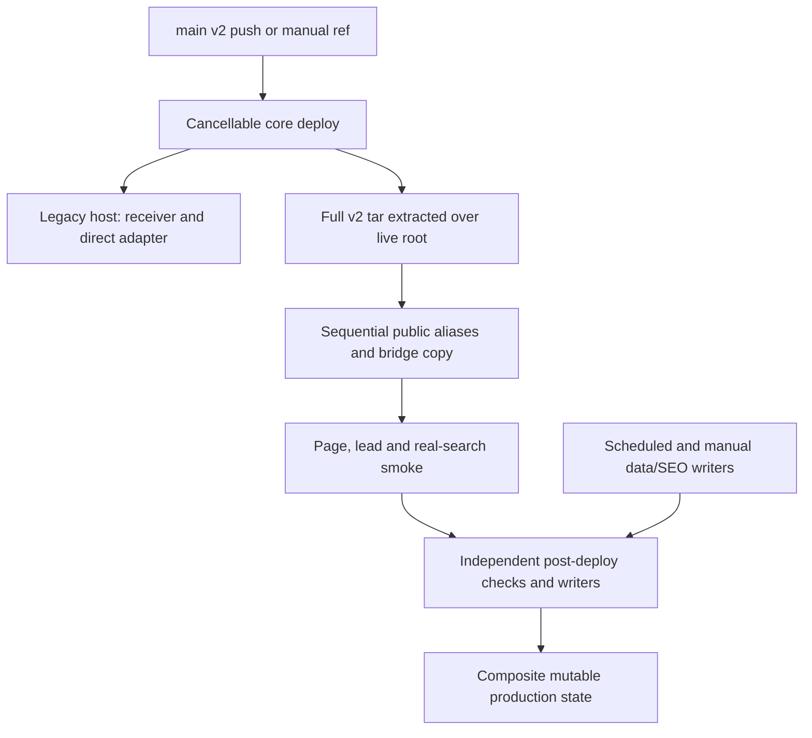

# AnyTour production release baseline audit

Status: completed read-only baseline; G0 and G6 are blocked
Observed: 2026-09-03 23:51–2026-09-04 00:03 UTC
Repository snapshot: `fa58a0cba6dcfc8624d98c20d64fa06330eae309`
Scope: production identity, artifacts, activation, rollback, canary and release
evidence for `anytoour.ru`

This audit records what the current release system can prove. Evidence
collection did not modify application/runtime files or either production host,
dispatch a workflow, submit a search, send a lead, merge a branch or deploy a
release. The stacked PR contains only documentation/governance changes; it is
not an authorization to implement or operate the HIGH-risk corrections below.

## Executive verdict

The public application is healthy at the observation time, but the release
mechanism is not safe enough to release Search3.

| Control | Verdict | What is known |
| --- | --- | --- |
| Current `main` | VERIFIED | `fa58a0cba6dcfc8624d98c20d64fa06330eae309` |
| Latest successful deploy source | VERIFIED | run 587 used the same SHA and all deploy steps passed |
| Exact live application SHA | **NOT VERIFIED** | `fa58a0c…` is the strongest control-plane inference, not an in-band live identity |
| Current public health | VERIFIED HEALTHY | home, search, Tourvisor health and expected lead bridge returned HTTP 200 |
| Immutable release artifact | **ABSENT** | deploy tar is temporary and every audited recent deploy retained zero artifacts |
| Last-known-good release | **UNDEFINED** | no LKG designation, retained package or `lkg` pointer exists |
| Atomic activation | **ABSENT** | the archive is extracted over the active document root and aliases are copied later |
| Exact rollback | **ABSENT / UNREHEARSED** | no rollback workflow or immutable target exists |
| Production canary | **ABSENT** | no internal allowlist, sticky cohort, percentage router or kill switch is implemented |
| Enforced approval | **ABSENT** | the deploy job has no GitHub Environment; `main` was reported unprotected with no rulesets |
| Search3 preview identity | PARTIALLY VERIFIED | its overlay assets identify and match `e5baf32f455cdb0aa1a704964f28e5efbebf57ff` |

`RELEASE_GATES.md` G0 (scope and identity) and G6 (operations) therefore fail.
This is a release-readiness failure, not evidence of a current public outage.

## Evidence language

- **VERIFIED** means directly observed in repository source, GitHub run metadata
  or a public GET response during the audit.
- **INFERRED** means the evidence is consistent and useful operationally but
  cannot independently identify the live filesystem.
- **UNKNOWN** means the current system emits no durable evidence that can answer
  the question.

Passing a smoke check is not upgraded to exact release identity unless the
live response independently reports and proves the same immutable release.

## Actual release graph

The graph crosses two hosts and several independently scheduled workflows. A
single successful core job does not delimit all code and generated state that
can subsequently become public.

## What the current deploy actually does

The canonical workflow is
[`deploy-anytoour.yml`](https://github.com/pyatkoff/poisk-turov-test/blob/fa58a0cba6dcfc8624d98c20d64fa06330eae309/.github/workflows/deploy-anytoour.yml).

1. A push to `main` touching any `v2/**` path or the deploy workflow starts a
   production deploy. Manual dispatch is also enabled without an exact-SHA,
   reason or expected-current-release input (lines 3–20).
2. Local preflight lints a named PHP subset and derives JavaScript files from a
   comment in `v2/index.php` (lines 22–53). That comment names 24 scripts while
   the active bundle manifest contains 44; 20 active scripts are outside this
   deploy-time syntax check.
3. Four lead files are copied first to the legacy `anytour.online` receiver and
   its health endpoint is checked (lines 72–107).
4. The complete `v2` tree—723 tracked files at this snapshot—is archived. It is
   uploaded under a run-ID filename, extracted directly over
   `~/www/anytoour.ru`, then deleted (lines 109–125).
5. A later remote command copies three public aliases (lines 126–139):
   `lead-bridge-v1.php` over `lead-adapter-v2.php`, the source search entry over
   `search-page-v2.php`, and `home-entry-v1.php` over `index.php`.
6. Only after those mutations does the job verify public markers, issue a
   non-writing invalid-consent lead probe, and run one real Tourvisor search
   (lines 141–211).
7. Successful completion starts independent visual, journey, SEO and route
   jobs. Some only read production; the resort materializer publishes generated
   routes and sitemap state, while the hotel route lock deletes generated files.

The deploy has useful checks, but it is an in-place synchronization procedure,
not an immutable release transaction.

## P0 — public lead endpoint changes implementation during every deploy

The source archive contains the direct Bitrix adapter as
`v2/lead-adapter-v2.php`. Direct extraction first places that file at the public
`https://anytoour.ru/lead-adapter-v2.php` path. Only afterwards does a separate
command overwrite it with `lead-bridge-v1.php`, the expected public HMAC bridge.

The two implementations are materially different:

| File | Intended host/role | GET identity | Runtime dependency |
| --- | --- | --- | --- |
| `v2/lead-adapter-v2.php` | legacy Bitrix host | `v2-direct-bitrix-lead` | local Bitrix bootstrap |
| `v2/lead-bridge-v1.php` | public AnyTour host | `v2-hmac-bridge-bitrix-lead` | HMAC call to the legacy receiver |

Consequences:

- there is a confirmed interval in every core deploy where the public filename
  contains the wrong implementation;
- a lead in that interval can fail if the public host has no local Bitrix;
- cancellation or failure after extraction and before the alias copy can leave
  that wrong implementation active;
- updating the legacy receiver first can also create a cross-host version split
  before the public application is updated.

At `2026-09-04T00:02:47Z`, a read-only GET returned the correct bridge identity:
`{"ok":true,"adapter":"v2-hmac-bridge-bitrix-lead","version":2,"writes":true}`.
So this is a current P0 release-mechanism defect, not a claim that the endpoint
was broken at audit completion. No customer impact telemetry was available to
determine whether a real lead hit an earlier mismatch window.

## Non-atomic activation and observed cancellations

Core deploys share a concurrency group with `cancel-in-progress: true`. That
prevents two core deploy jobs from copying simultaneously, but permits a newer
push to cancel a job while it is mutating either host. There is no remote
transaction, shared writer lock or failure trap that restores prior files.

This risk has occurred inside mutation steps:

| Run | Source SHA | Observed cancellation | Skipped evidence | First later successful deploy |
| --- | --- | --- | --- | --- |
| [321](https://github.com/pyatkoff/poisk-turov-test/actions/runs/33562205830) | `204bb91ad58083543c2dea0b6a83a12593fd2026` | `Copy release to …ru`, 2026-09-01 21:39:37–21:41:16 UTC | public, lead and search checks | [322](https://github.com/pyatkoff/poisk-turov-test/actions/runs/33562388094), `dbc1972…` |
| [440](https://github.com/pyatkoff/poisk-turov-test/actions/runs/33621925906) | `98b3700e78c75f80aef2ff6106c60d9fff9a250e` | live copy, 2026-09-02 10:55:37–10:55:55 UTC | public, lead and search checks | [441](https://github.com/pyatkoff/poisk-turov-test/actions/runs/33621975379), `88bc9e1…` |
| [540](https://github.com/pyatkoff/poisk-turov-test/actions/runs/33735478285) | `b76a058fd3e9f7be13ba20d568283e00394d4406` | legacy lead receiver, 2026-09-03 08:50:01–08:50:12 UTC | main copy and every live check | [541](https://github.com/pyatkoff/poisk-turov-test/actions/runs/33735501866), `3a4df4f…` |

Each later successful run copied a newer SHA and passed its own smoke checks. It
did not prove what visitors saw during the preceding window or that every stale
file was removed. The workflow only overwrites archive members and explicitly
removes `index.html`; a file deleted from Git otherwise remains on production.

Run [580](https://github.com/pyatkoff/poisk-turov-test/actions/runs/33806120219)
shows the inverse status ambiguity: GitHub classified the run and job as
`cancelled` even though copy, all live checks, checkout cleanup and the visible
`Complete job` step succeeded. Therefore neither `success` nor `cancelled`
alone is an authoritative statement of what is active.

## Current identity evidence

### Control plane

- `main` was `fa58a0cba6dcfc8624d98c20d64fa06330eae309`.
- Latest core deploy
  [run 587](https://github.com/pyatkoff/poisk-turov-test/actions/runs/33814797295)
  used that SHA and finished successfully at `2026-09-03T22:49:51Z`.
- Its copy ran from `22:49:14Z` to `22:49:29Z`; public, lead and search checks
  all passed by `22:49:47Z`.
- The latest eleven inspected deploy runs retained no artifacts. Run 587 also
  had no pending GitHub Environment deployment approval.
- GitHub Releases were empty. The deploy job does not reference an
  `environment:` and all repository workflows were statically found without an
  `environment:` declaration.

This makes `fa58a0c…` the best current application-source inference.

### Public data plane

Read-only GET checks observed:

| Surface | Result | Identity value |
| --- | --- | --- |
| `/` | HTTP 200 | no release/SHA header, ETag or Last-Modified |
| `/poisk-turov/` | HTTP 200 | no release/SHA header, ETag or Last-Modified |
| `/api-v2.php?action=health` | HTTP 200 | `source=tourvisor-direct`, `gatewayVersion=2`; no SHA |
| `/lead-adapter-v2.php` | HTTP 200 | expected HMAC bridge, version 2; no SHA |
| common release manifest paths | HTTP 404 | `/release.json`, `/version.json`, `/build.json`, `/deployment.json` and `.well-known` variants absent |

The active production CSS and JavaScript bundles were downloaded and matched
the bundle generated from `fa58a0c…` byte for byte:

| Bundle | Content version | Bytes | Full SHA-256 |
| --- | --- | ---: | --- |
| CSS | `7f0f9b10485e9ee7` | 233,559 | `a5c730278d3d0e6edbd3c8cb4aa3022e289292bb252c5b58081a332f4d703fd8` |
| JS | `577305cb3f466d6f` | 281,612 | `3c669285e4d8166d79695999422c2b0ce194414fa449de41796b0299a4af93a8` |

This still does not identify the deployed SHA. The last commit touching an
active bundle input was `0aca8a6c823dc1c0f29ff8d58766c0e64f53066b`, followed by 552 commits through
the audited `main`; the same bundle versions therefore cannot distinguish those
later server/PHP/content releases. Bundle identity also excludes PHP, route
files, the legacy receiver, generated content, mutable data and stale files.

**Production application SHA: `UNKNOWN`, with `fa58a0c…` as the strongest
probable source.** It must not be promoted to VERIFIED in a release record.

### Search3 preview

The preview is materially better identified, but is not a production canary:

- `/_preview/search3/poisk-turov/` returned HTTP 200 and
  `X-Robots-Tag: noindex, nofollow`;
- all 50 Search3 overlay assets used `v=e5baf32f455c`;
- that prefix uniquely resolves to
  `e5baf32f455cdb0aa1a704964f28e5efbebf57ff` and sampled/downloaded assets
  matched that commit byte for byte;
- the preview deploy deliberately returns 403 from its lead endpoint;
- the preview itself is deleted/recreated in place by a cancellable workflow,
  so even its better asset attribution is not an atomic candidate artifact;
- it still loads the retired three-script consultant integration from
  `anytour.online`, while current production loads the canonical
  `https://app.anytoour.ru/web-consultant/widget.js`;
- no production visitor routing, sticky assignment, metric split or instant
  fallback connects this preview to `/poisk-turov/`.

The preview can support visual/reference work. It cannot prove production lead
delivery, rollback or cohort safety.

## Why production is a composite, mutable state

The core tar is not the only writer to the public tree:

- successful core deploys start a resort materializer that refreshes data and
  publishes generated routes and sitemap state under a different concurrency
  group;
- a hotel-route lock independently deletes route and registry files on deploy,
  schedule or manual dispatch;
- catalog/data workflows copy all or selected `v2/data/**` source into the live
  tree and may run on schedules or manual dispatch;
- favicon and feed deployment use independent concurrency groups;
- immutable application files, configuration, secrets, generated routes and
  operational data share one filesystem hierarchy.

Several `workflow_run` consumers check out moving default `main`, not the
triggering `workflow_run.head_sha`. The price evidence job then labels live
evidence with the triggering SHA even though its checked-out verification code
may be newer. Public writers also do not share a server-side lock.

A useful future identity must therefore distinguish at least:

1. immutable application artifact and source SHA;
2. public lead bridge plus compatible legacy receiver/adapter release set;
3. generated SEO route/sitemap manifest and generator SHA;
4. mutable data/schema state;
5. separately deployed feed/favicon components where operationally relevant.

## What a green core deploy proves—and does not prove

| A green run supports | A green run does not support |
| --- | --- |
| selected PHP files parsed before transfer | exact live filesystem equals the source SHA |
| 24 comment-listed JS files parsed | all 44 active scripts were validated by deploy |
| both SSH credentials worked | SSH host authenticity; host-key checking is disabled |
| legacy receiver GET returned expected marker | compatible cross-host lead behavior for the whole release |
| copy and alias commands exited successfully | atomic visibility or absence of a mixed-release window |
| home/search/API/lead markers returned expected values | identity attribution to the candidate SHA |
| one real Tourvisor search completed | negative paths, no-flight lead fallback or downstream lead delivery |
| the final sampled state was healthy | automatic rollback if any later check or writer fails |
| core workflow finished | post-deploy materializers and independent writers finished safely |

Existing strengths should be preserved: pre-copy linting, separate host keys,
config/logo guards, public health checks, a non-writing lead validation probe,
a real Tourvisor search, and SHA-pinned checkout in the journey and visual
post-deploy workflows.

## LKG and rollback assessment

No authoritative LKG exists. Run 586 / `7daa63f…` is merely the previous
successful deploy source; it was not designated as good, retained as an
artifact or stored behind an LKG pointer.

Re-dispatching an old branch or tag is not exact rollback because:

- manual dispatch has no full-SHA and expected-current-release contract;
- the package must be rebuilt instead of using the artifact that was tested;
- in-place extraction does not delete files introduced by a newer release;
- aliases and two-host lead components can be left at different versions;
- generated routes, mutable data and schema state sit outside the core job;
- no public identity can prove convergence after the attempt.

There is no safe documented production rollback command to execute today. A
future runbook must switch to a pre-validated retained artifact and prove the
observed live identity before and after rollback; it must not rely on cleanup or
rebuilding a moving ref.

## Canary and approval assessment

| Capability | Current state | Release requirement |
| --- | --- | --- |
| Isolated Search3 reference URL | present | keep it non-production and noindex |
| Internal allowlist | absent | server-enforced, auditable and instantly disableable |
| Sticky cohort assignment | absent | one visitor remains on one compatible UI profile |
| Percentage rollout | absent | observable 10→25→50→100 routing or approved non-percentage switch |
| Variant/release response marker | absent | return both immutable release and UI profile identity |
| Kill switch independent of deploy | absent | route all users to LKG without rebuilding or copying |
| Production Environment approval | absent from workflow | required reviewers and exact release record |
| Protected `main` gate | absent at audit | required checks and restricted direct updates |

Search3 must continue to use the same protected Tourvisor, price, analytics and
lead endpoints. Cohort routing belongs at the page/profile boundary; it must not
create two external lead contracts.

## Additional live observations outside this fix

- The homepage and search page both emitted `noindex,follow`; `robots.txt`
  allowed crawling and neither route appeared in the sitemap. Search-page
  noindex may be intentional, but homepage noindex needs a separate SEO/product
  decision because it can limit branded discovery. Do not change it inside a
  release-safety PR.
- Search3 preview emitted a `noindex,nofollow` HTTP header while its inherited
  meta value said `noindex,follow`. The header is stricter, so the preview
  remains protected, but the conflicting signals should be cleaned up in the
  reference/SEO scope.
- Bundle ETags observed through compression included `-gzip`, while the PHP
  comparison expects the unsuffixed content version. The returned compressed
  ETag produced HTTP 200 and the unsuffixed ETag produced 304. This validator
  mismatch is a separate cache correctness task, not an exact-SHA substitute.

## Recommended implementation sequence

Every item below that changes production workflow, server layout, lead-file
deployment or routing is HIGH risk and requires explicit owner approval. No
such item is authorized by this audit.

| Order | Narrow slice | Result | Exit evidence |
| ---: | --- | --- | --- |
| 1 | `release/package-contract` | build-only, target-specific immutable package; bridge is already at the public filename; direct adapter is excluded from the public target; complete 44-script validation; manifest and checksums | deterministic rebuild test and zero production writes |
| 2 | `release/deploy-cancellation-containment` | active production mutation cannot be cancelled; all public writers use one remote lock; pinned SSH host keys | cancellation/failure injection on an isolated target leaves active version unchanged |
| 3 | `release/exact-sha-boundary` | explicit full SHA, retained artifact, protected Environment, expected-current guard and public/component manifest | candidate SHA/artifact digest agrees in CI, server and public response |
| 4 | `release/atomic-current-lkg` | versioned immutable directories, separated shared state, atomic `current` switch and independently promoted `lkg` | candidate↔LKG rehearsal with checks at every failpoint |
| 5 | `release/evidence-and-writers` | every verifier pins trigger SHA and checks live identity; mutators are serialized and publish component identity | no evidence can be attributed to a different live release |
| 6 | `release/cohort-routing` | internal allowlist, sticky observable cohort and independent kill switch | deterministic assignment, zero cross-profile state loss and instant LKG fallback |

The first package must be assembled into its final target layout before upload:
`lead-bridge-v1.php` becomes public `lead-adapter-v2.php`, the direct adapter is
packaged only for the legacy receiver set, and search/home aliases are material
files inside the artifact. A deployment must never publish a source-layout
intermediate state.

The LKG pointer must be promoted only after an agreed stabilization decision;
`previous` and `last known good` are not synonyms. Database/schema evolution
must use backward-compatible expand/contract rules so an application rollback
does not depend on reversing customer or operational data.

## Decision required before implementation

The safest next change is a draft-only `release/package-contract` slice that
performs no production write, followed by a separately approved HIGH
containment/cutover sequence. Approval must name whether work may touch:

- `.github/workflows/deploy-anytoour.yml`;
- public-versus-legacy lead artifact mapping while preserving URL, payload,
  fields and delivery behavior;
- the production server release-directory/shared-state layout;
- GitHub Environment, branch protection and SSH host-key configuration.

No workflow change should be merged casually: changing the canonical deploy
workflow is itself in that workflow's production trigger path.
