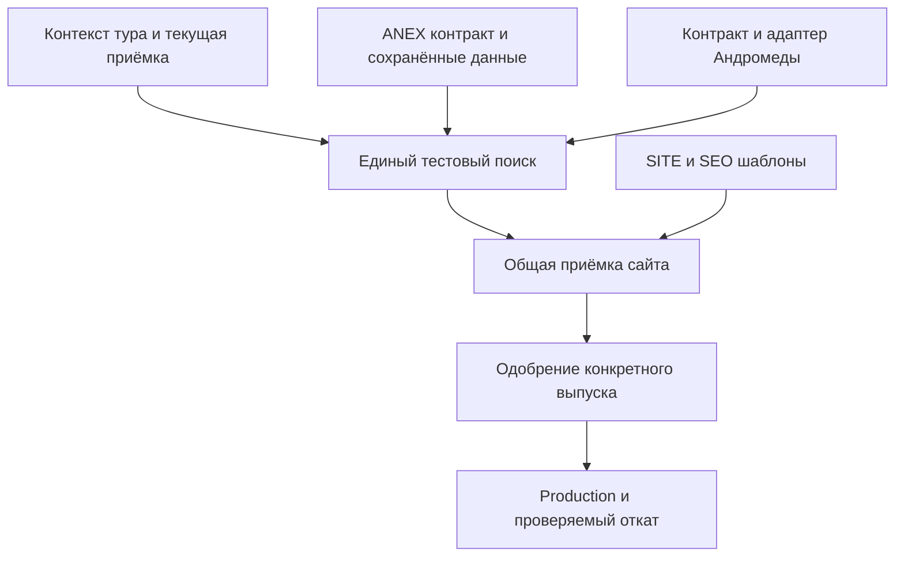

# Порядок разработки, интеграции и выпуска

Координатор — #996. Четыре направления дают части одного AnyTour. Этот документ
определяет зависимости и условия перехода; состояние конкретной работы остаётся
в существующих issues и `current_task`, не в новой параллельной базе задач.

## Две рабочие основы и тестовые среды

| Ветка / среда | Назначение | Как попадают изменения |
| --- | --- | --- |
| `release/search3-production-ready-v1` | Общий поиск, сайт, SEO и принимаемые интеграционные пакеты | Короткие PR-ветки от свежей release |
| `feature/anex-search-adapter-20260907` | Текущие ANEX/data/panel работы, подготовка Андромеды | Короткие PR-ветки от свежей ANEX; не развивать отдельный вечный сайт |
| `/_preview/search3-site-candidate/` | Единый тестовый сайт актуальной release | Только его exact artifact и разрешённый isolated workflow |
| `/_preview/search3-anex-candidate/` | Изолированная проверка ещё не перенесённой интеграции | Только scoped ANEX artifact; не копия поверх whole-site |
| `main` / production | Одобренная пользователем версия | Конкретный проверенный release после отдельного допуска, с rollback |

Четыре направления — четыре очереди ответственности, не четыре постоянных ветки.
Рабочие PR-ветки могут быть многочисленнее; после интеграции пакет завершается.
Тестовый URL не доказывает изоляцию БД: ANEX diagnostics используют существующие
production-backed read-only данные и отдельно разрешённые таблицы. DB apply всегда
проходит собственные preservation/permission gates; «это тест» не разрешает любые записи.

## Волны работ

| Волна | Что делаем | Что можно параллельно | Условие выхода |
| --- | --- | --- | --- |
| A — ближайшие полезные пакеты | Текущий SEARCH acceptance; проект source-qualified выбора; P2 storage/auth подготовка | SITE оставшаяся приёмка; SEO матрица; сбор официального контракта Андромеды | У каждой ветки есть проверенный результат или точный входной блокер, а не повтор старого отчёта |
| B — работающий выбор и панель | Point-TV own context; ANEX contract/честный selected; persistent panel storage + trusted auth | SITE handoff/правдивый контент; SEO шаблоны на сохранённых данных | Выбор сохраняет источник; панель доступна только владельцу и пишет/читает решения с guards |
| C — единый общий тестовый сайт | Bounded ANEX→fresh release; один renderer/filter/selected; удалить дубли после паритета | Андромеда adapter выключен; SITE/SEO независимые шаблоны | TV и ANEX работают в общем preview, partial failures/generation/return подтверждены |
| D — третий источник и продуктовая приёмка | Андромеда через тот же контракт после официальных входов; end-to-end mobile/desktop | SEO rollout proposal по реальным данным | Конкретный release имеет список готового/deferred и exact artifact; владелец может его оценить |
| E — одобренный выпуск | Scoped production migration, smoke, rollback; отдельное решение по SEO индексации | Разработка следующих preview-пакетов продолжается | Проверены опубликованный source/фактические сценарии; непроверенное не скрыто |

Волны — зависимости, не обещанные календарные сроки. Каждый пункт дробится на
проверяемые PR-пакеты из четырёх планов. Если API Андромеды или auth пока недоступны,
не задерживать остальные направления и не объявлять волну целиком выполненной.
Release может включать готовые TV+ANEX без Андромеды по отдельному согласованному scope;
SEO можно выпускать позже. План не требует дождаться всех отелей/всех страниц.



Андромеда входит в C только в выпуске, где она включена в scope; её вход не блокирует
первую приёмку TV+ANEX. Панель имеет собственный protected rollout и не обязана
публиковаться тем же артефактом, что открытая выдача.

## Передача INT → SEARCH

1. INT выдаёт handoff: source SHA, список файлов, реальные input/output fixtures,
   capabilities/unknown, mapping precedence, budgets, tests и private/runtime зависимости.
2. Координатор фиксирует свежий destination release SHA и одного owner общих файлов.
   При наличии чужого active claim передать ему требования, а не параллельно править файл.
3. Выделить минимальный adapter/registry/projection пакет. Не merge #1493 целиком;
   переносить только проверенную функцию, учитывая актуальный UI и manifest.
4. Согласовать versioned internal contract и одного владельца compatibility shim,
   если он временно нужен. Записать условие его удаления, не добавлять вечный слой.
5. На тех же fixtures проверить TV-only/ANEX-only/both, missing mappings, цены/питание,
   late/error/stale ответы и выбранное предложение. Защищённые URL/lead/арифметику сохранять.
6. Exact source artifact → common preview → фактическая приёмка затронутого пути.
   После паритета прекратить параллельное развитие перенесённой функции в addon.
7. В issues обоих направлений сохранить source/destination/artifact/checked/deferred.
   Old checkpoint остаётся историей, не next action. DB histories/decisions не переносятся
   через перезапуск catalog/matcher; использовать существующее хранилище/проверенный importer.

## Пакет, который можно поручить исполнителю

```text
ID и issue; направление; status: ready/in_progress/blocked/done
Пользовательский результат; подтверждённый дефект/согласованный сценарий
Source branch/SHA; receiving branch/SHA; exact owned paths; claim в #996
Зависимости и входные fixtures/источник фактов; unknown
Модель/effort/роль; независимый reviewer при существенном риске
Действия и предел: scope, supplier/DB budget, protected contracts
Acceptance: наблюдаемые проверяемые условия
Проверка: узкий test + применимый CI; visual только изменённого пути
Выход: PR/source SHA; implemented/checked/preview-published/production-approved
Rollback; реальный blocker/deferred; следующий свободный шаг
```

Размер пакета задаётся целостностью сценария, а не числом файлов или искусственным
микро-PR. Не объединять auth, общий renderer и SEO rollout в один нерецензируемый diff.
Подготовительные read-only задачи допустимы независимо; shared writes/deploy последовательны.
Автоматика не принимает «план» за разрешение на новые protected операции.

## Проверки и качество

- Docs-only: согласованность ссылок/ID/зависимостей/правил. Никаких supplier/DB/browser/
  deploy ради документов; автоматические обязательные проверки не отключаются.
- Scoped UI: существующий узкий fixture + применимые owner/Security/artifact; одна
  сборка связного финального source, затем использовать exact artifact.
- Auth/DB: disposable MySQL для транзакций, stale/replay/pair exclusions, частичной
  migration и идемпотентности; live только разрешённый pinned apply/readback.
- Адаптер: сохранённые реальные fixtures, invalid/missing response, token budget,
  no double process; live probe лишь при конкретном оставшемся риске/допуске.
- User-facing: релевантные desktop/mobile состояния и реальные изображения, не только
  green CI. Физический Safari и недоступные live gates явно deferred.
- Успешный статус workflow без содержимого artifact/manifest/readback не доказывает
  публикацию, миграцию или принятие соответствий.

## Конкретный допуск production

До вопроса владельцу подготовить reviewable release: ссылка на общий тестовый сайт,
source/artifact digest, включённые направления/флаги, проверенные сценарии и открытые
риски; предыдущий artifact, план отката и DB compatibility. Не спрашивать об абстрактной
публикации, когда результат ещё не собран.

После явного одобрения именно этой версии выполнить штатную миграцию и проверить
provenance/маршруты/статусы/сохранность. Изменение после одобрения, затрагивающее scope
или риски, требует новой конкретной приёмки. Production SEO индексация и доставка
тестовой заявки проверяются только в границах отдельного действующего допуска.
Это не новое разрешение менять main, сервер, цели Метрики или внешний lead contract.

## Контроль прогресса

Измерять новые рабочие сценарии и закрытые риски: доступные offers, сохранный context,
owner decisions/readback, полезные страницы/переходы, подтверждённые SEO данные.
Отдельно measured counts с датой/выборкой; не обещать проценты роста конверсии/SEO и
не считать число PR или повторных snapshots результатом. Если доступен следующий
безопасный пакет — продолжить; если нет, оставить конкретную точку без повторного спама.
